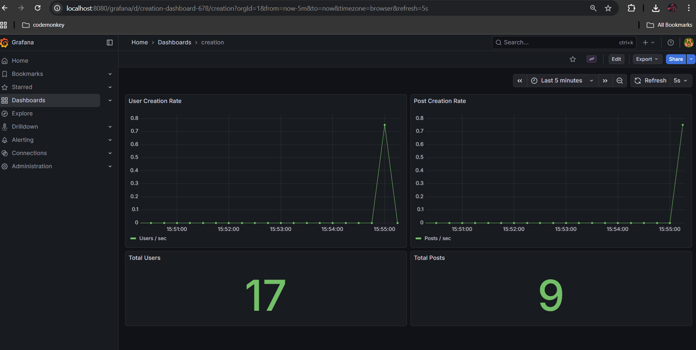

# Full Observability Docker-in-Docker Project (FastAPI + PostgreSQL + Prometheus + Grafana + Helm + Ingress)

## 📌 Overview

This project is a fully containerized microservice setup demonstrating end‑to‑end DevOps implementation with monitoring and dashboard visualization. It includes a FastAPI service instrumented with Prometheus metrics, a PostgreSQL database, and a complete observability stack deployed via Helm on Kubernetes.

The project showcases:

* Docker‑in‑Docker containerized environment
* FastAPI backend with user & post creation endpoints
* PostgreSQL persistence
* Prometheus metrics scraping
* Grafana dashboards for real‑time metric visualization
* Kubernetes Helm chart deployment
* NGINX Ingress routing
* Custom stat + graph panels for request analytics

---

## 🏗️ Architecture

```
+---------------- Kubernetes Cluster ----------------+
|                                                    |
|  +-----------+       +-------------+               |
|  | FastAPI   | <---> | PostgreSQL  |               |
|  +-----------+       +-------------+               |
|        | /metrics          ^                       |
|        v                   |                       |
|  +------------------------------+                  |
|  |        Prometheus            |                  |
|  +------------------------------+                  |
|                | scrape                            |
|                v                                   |
|       +----------------+                           |
|       |    Grafana     | <---- Custom Dashboard ---|---------
|       +----------------+                           |
|                                                    |
| Ingress -> /users /posts /grafana                  |
+----------------------------------------------------+
```

---

## ⚙️ Technologies Used

| Component        | Technology              |
| ---------------- | ----------------------- |
| Backend API      | FastAPI + Python        |
| Database         | PostgreSQL              |
| Monitoring       | Prometheus              |
| Dashboard        | Grafana                 |
| Deployment       | Helm Charts             |
| Containerization | Docker / Docker‑Compose |
| Networking       | NGINX Ingress           |

---

## 🚀 Setup Instructions

### 1. Clone Repository

```bash
git clone <repo-url>
cd docker-observability-project
```

## Running the Container

### 1. Direct Docker Commands

```bash
# Build - Creates the Docker image from Dockerfile
docker build --no-cache -t wiki-cluster .

# Run - Starts the container with required privileges
docker run --privileged --cgroupns=host -p 8080:8080 -it wiki-cluster
```

### 2. Windows

```cmd
.\run.bat all      # Build the image and run the container
.\run.bat build    # Build the Docker image only
.\run.bat run      # Run the container (image must exist)
.\run.bat clean    # Stop and remove all wiki-cluster containers
```

### 3. Linux / macOS

```bash
# First time only - Make script executable
chmod +x run.sh

# Usage
./run.sh all       # Build the image and run the container
./run.sh build     # Build the Docker image only
./run.sh run       # Run the container (image must exist)
./run.sh clean     # Stop and remove all wiki-cluster containers
```

## Access

```
http://localhost:8080
```

## Why Not Docker Compose?

Docker Compose was not used because the `cgroupns: host` property is not supported in the Docker Compose and the container won't start without this flag.

### 4. Access Endpoints
-------------------------------------------------------------------------------------
| Service            | URL                                                          |
| ------------------ | ------------------------------------------------------------ |
| FastAPI create user| `http://localhost/user/{id}` / `http://localhost/posts/{id}` |
| Grafana Dashboard  | `http://localhost/grafana`                                   |
| Prometheus         | `http://localhost/prometheus`                                |
-------------------------------------------------------------------------------------
---

## 🧪 API Endpoints

### Create User

```bash
curl -X POST http://localhost:8080/users \
  -H "Content-Type: application/json" \
  -d '{"name": "John Doe"}'
```

Response:

```json
{"id":8,"name":"John Doe","created_time":"2025-11-23T10:05:50.193645Z"}
```

### Create Post

```bash
curl -X POST http://localhost:8080/posts \
  -H "Content-Type: application/json" \
  -d '{"user_id": "1", "content": "hello world"}'
```

---

## 📊 Monitoring & Metrics

Metrics exposed from FastAPI:

```python
users_created_total
posts_created_total
```

Example Prometheus query to validate metric ingestion:

```promql
rate(users_created_total[15s])
```

---

## 📈 Grafana Dashboard

Includes:

* Stat panel showing Users & Posts creation rate
* Time series panel showing historical creation trends
* Auto‑refresh visualization

```

```

---

## 📦 Project Structure

```
.
├── wiki-chart              # Helm chart
│   ├── templates
│   ├── values.yaml
│   └── ...
├── fastapi-app
│   ├── main.py
│   └── metrics
├── prometheus
├── grafana
└── docker-compose.yml
```

---

## 🤝 Contributing

Pull requests are welcome! Feel free to open issues for suggestions.

---

## 📨 Contact

**Javed Ahmed Chaudhary**
DevOps Engineer | Cloud & Infrastructure Automation
